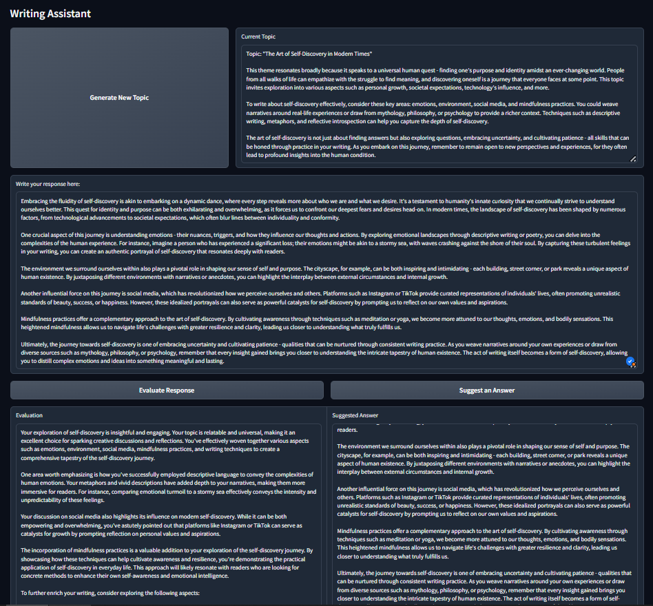

# English Learning Tool

This project is a web-based English learning tool that allows users to improve their writing skills by engaging in discussions on suggested topics. The tool provides feedback on user input in terms of clarity, grammar, and adherence to the topic. Additionally, it can suggest answers to topics, helping users to learn through examples.



## Features

- **Topic Suggestion**: Automatically generates a writing topic with a brief commentary to guide users.
- **User Input Evaluation**: Evaluates user responses for clarity, grammar, and relevance to the topic, offering suggestions for improvement.
- **Suggested Answers**: Provides suggested answers to the current topic to help users learn through examples.
- **Topic Refresh**: Allows users to request a new topic for discussion.

## Project Structure

```
.
├── gradio_frontend.py     # Gradio frontend interface
├── images/
│   └── image.png          # Example image used in the README.md
├── learning_language/
│   ├── backend.py         # Backend logic for handling requests and responses
│   ├── __init__.py        # Initialization file for the learning_language package
│   ├── llm.py             # Interface with a language model (e.g., OpenAI GPT)
│   ├── model_dataclass.py # Data classes for managing model configurations
│   └── prompts.py         # Templates and utilities for generating prompts
├── README.md              # Project documentation
├── requirements.txt       # Python dependencies
└── streamlit_frontend.py  # Streamlit frontend interface
```

## Installation

### Prerequisites

- Python 3.8+
- pip (Python package installer)

### Clone the Repository

```bash
git clone https://github.com/KameniAlexNea/english-learning-tool.git
cd english-learning-tool
```

### Set Up the Environment

1. **Create a Virtual Environment** (Optional but recommended):

   ```bash
   python3 -m venv env
   source env/bin/activate  # On Windows use `env\Scripts\activate`
   ```
2. **Install the Required Packages**:

   ```bash
   pip install -r requirements.txt
   ```
3. **Set Up Environment Variables**:

   Create a `.env` file in the `backend/` directory with your OpenAI API key:

   ```bash
   cd backend
   touch .env
   ```

   Add the following to your `.env` file:

   ```env
   OPENAI_API_KEY="..."
   OLLAMA_CONFIG_MODEL="smollm2:latest"
   OPENAI_CONFIG_MODEL="gpt-4o-mini"
   USE_OPENAI="0" # use of ollama, set to 1 for openai
   ```

## Usage

### Start the Frontend Interface

You can use either Gradio or Streamlit as the frontend interface.

#### Using Gradio

Open a new terminal, navigate to the root directory, and start the Gradio app:

```bash
python gradio_frontend.py
```

This will launch the frontend in your default web browser.

#### Using Streamlit

Open a new terminal, navigate to the root directory, and start the Streamlit app:

```bash
streamlit run streamlit_frontend.py
```

This will also launch the frontend in your default web browser.

1. **Topic Suggestion**:

   - Upon loading the app, a topic is suggested automatically.
   - Click "Suggest New Topic" to receive a different topic.
2. **Writing Your Response**:

   - Type your response to the suggested topic in the provided text area.
   - Click "Evaluate" to receive feedback on your writing.
3. **Suggesting an Answer**:

   - Click "Suggest an Answer" to generate an example response based on the current topic.

## License

This project is licensed under the MIT License. See the [LICENSE](LICENSE) file for more details.

## Contributing

Contributions are welcome! Please fork the repository and create a pull request with your changes.

## Contact

For questions or feedback, please reach out to [...].
